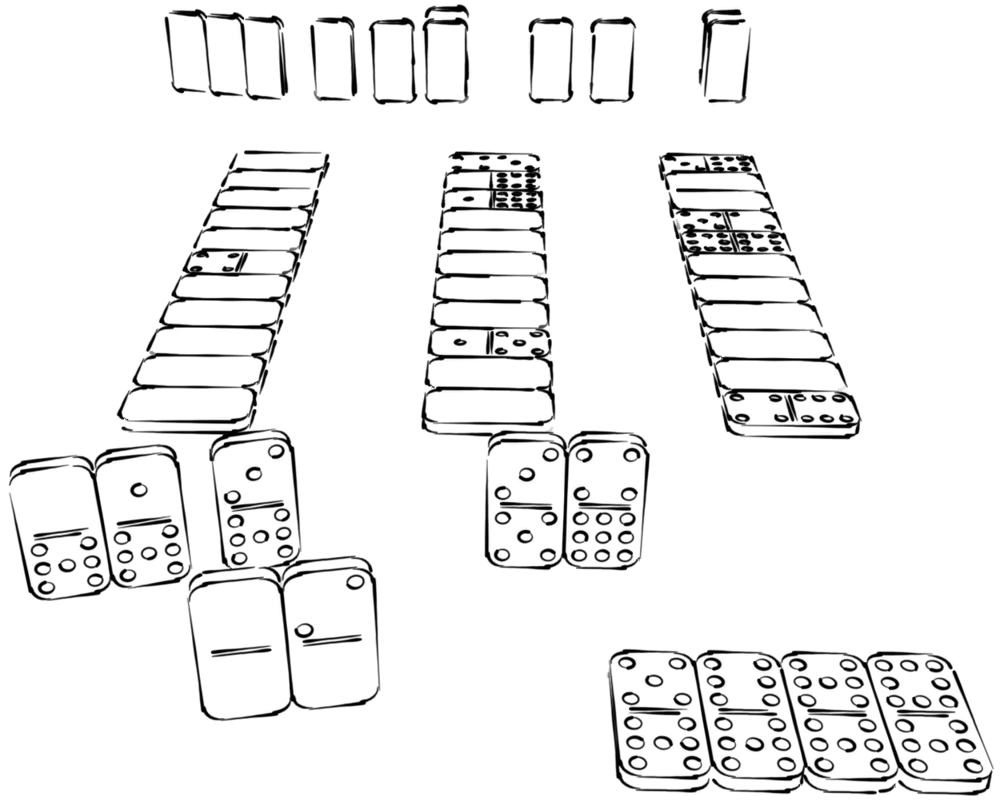

# Conveyor Rummy &beta;1.1.0
A Rummy-like game for 2-4 players played entirely with dominoes.
Over a series of turns, players draw tiles from a number of columns&mdash;or "conveyors", trying to complete sets and runs&mdash;called _melds_.
Whoever gets rid of all their dominoes first wins the round. 
Whoever has the most points at the end of the game wins.

# About This Repository
This repo contains a LaTeX files necessary to complile the rulebook PDF.
The PDF outlines how to play the game.

Note that this is **NOT** a videogame but instead a board game. Keep this in mind.

# Downloading the Game
You can find a link to the latest version of the PDF [[here](https://github.com/ElectricCoffee/Conveyor-Rummy/releases)]